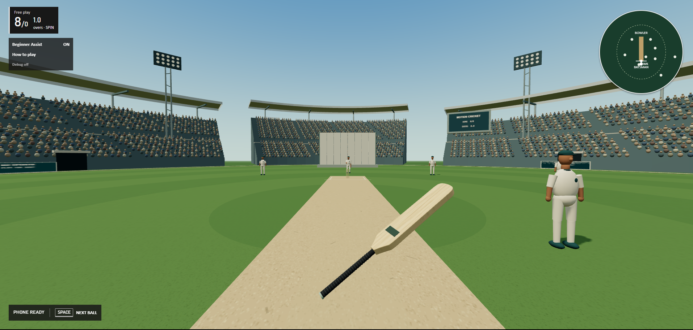
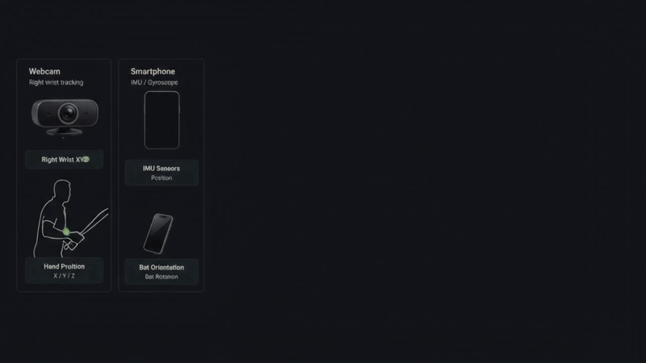
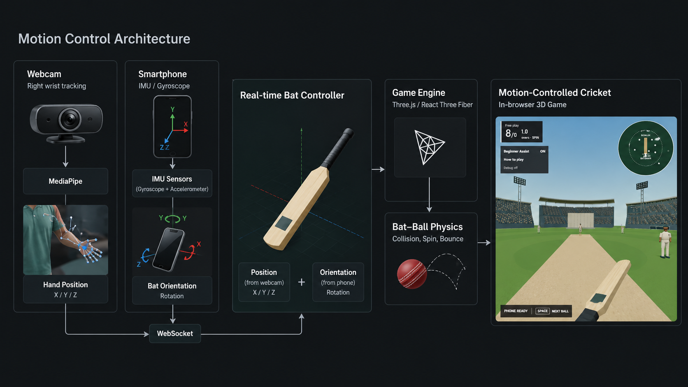
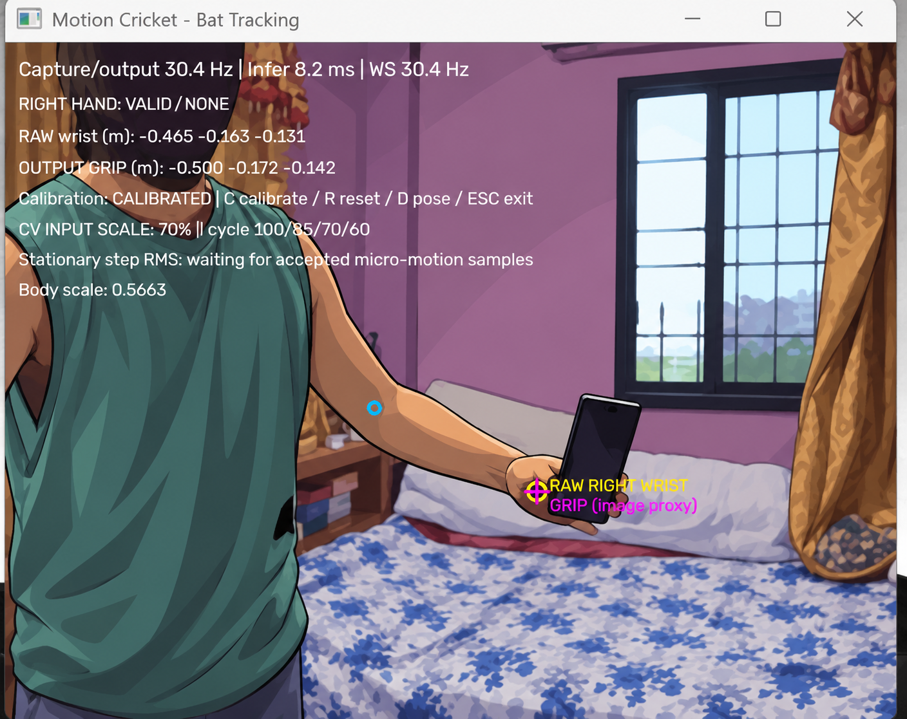
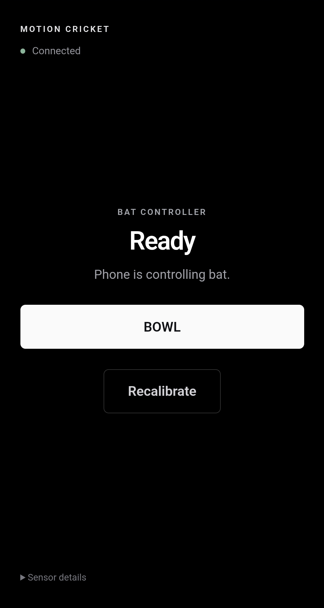

# Motion-Cricket

**Physical batting. Real motion. Browser cricket.**

A motion-controlled 3D cricket game where you physically move the bat rather than select a canned shot animation. A webcam tracks right-wrist position, while a smartphone's motion sensors supply bat orientation. The browser combines both inputs to drive the bat and resolve contact with the ball in real time.

**[Public demo](https://play.motioncricket.workers.dev)** — open on your desktop, then use its phone setup QR/session link. Webcam input still requires the local Python tracker.

<p align="center">
  
</p>

    

## Why Motion-Cricket is different

There is no button that selects a cover drive or triggers a predefined batting animation. Webcam movement translates the handle, phone movement rotates the blade, and contact physics determines the resulting shot. The player is represented primarily by the bat, intentionally focusing on physical control rather than a full animated batsman.

The screenshot above shows the current game. The video below is an **architecture walkthrough**, not gameplay footage.

## How Motion Control Works

Two independent input paths meet in the browser:

```text
Laptop webcam -> Python / MediaPipe -> calibrated right-wrist XYZ -> handle position
Smartphone   -> orientation / motion sensors -> calibrated quaternion -> bat rotation
                                      |
                         React / React Three Fiber / Three.js
                                      |
                           Bat-ball contact and gameplay
```

Locally, the Python bridge publishes controller JSON on `ws://127.0.0.1:8765`. Vite proxies this through `/cv-ws`, while its `/phone-ws` relay forwards phone controller messages to the game. The public demo uses same-origin secure WebSockets through a Cloudflare Worker and an ephemeral six-character room; phone and tracker join the desktop's room without sharing a LAN. Latest-state delivery avoids a backlog of old sensor samples.

The phone is not an absolute-position tracker: accelerometer data is **not** integrated to obtain handle position. Webcam wrist tracking does not provide the phone-controlled bat orientation.

<p align="center">
  
</p>

<details>
<summary><b>View high-resolution architecture diagram</b></summary>



</details>

**[Watch the architecture walkthrough (MP4, 19 seconds, approximately 43 MB)](docs/assets/architecture-video.mp4)**

The diagram and animation are conceptual illustrations, not recordings of the live input pipeline or a deployed site. The descriptions here reflect the current runtime. The animation loops inline; the MP4 remains available as the higher-quality source.

## Computer Vision Tracking

<p align="center">
  
</p>

OpenCV captures the default webcam and MediaPipe Pose Landmarker estimates body landmarks. The right wrist is the position measurement used for gameplay; the left wrist is not a substitute controller.

Calibration establishes a fixed batting reference frame and shoulder-width scale. Body-scale normalization compensates for drift in MediaPipe's estimated world-coordinate scale. A single adaptive position filter responds gently to rest noise and more quickly to deliberate movement, while confidence, finite-value and jump checks reject unusable samples.

The bridge sends position, velocity, confidence, acceptance and calibration state—not webcam frames. The browser maps calibrated coordinates into a bounded game-space handle range. A separate visual-only deadband reduces visible micro-jitter without changing the contact position used by gameplay. Missing or stale input holds the last usable handle position rather than integrating velocity indefinitely.

These are model-estimated coordinates, not motion-capture measurements. Lighting, camera distance, wrist occlusion and the phone covering the hand can affect tracking. The screenshot is privacy-treated; it illustrates the diagnostic display, not a tracking-quality benchmark.

## Smartphone Bat Controller

<p align="center">
  
</p>

The phone opens a browser controller on the same local network. Device orientation supplies a calibrated quaternion; gyroscope motion supplies angular velocity, with quaternion differences as a fallback. Calibration relates the phone's physical axes to the bat and the player's stance.

The phone's top edge points along the imagined blade and its screen represents the blade face. Keep it securely held throughout play. **BOWL** requests the next AI delivery in batting; **Recalibrate** resets the orientation reference. The phone is never physically released.

Sensor permissions and trusted HTTPS are required for the supported mobile setup. Keep the page foreground and screen unlocked. Losing webcam position does not redefine phone rotation; stale phone input disables contact rather than treating old sensor data as a fresh swing.

See [phone setup and calibration](web/PHONE_CONTROLLER.md) for certificate trust, device axes and connection troubleshooting.

## Gameplay and Bat-Ball Physics

The bat moves continuously in 3D. Swept collision tests the ball against the moving bat between updates, reducing missed contact when either moves quickly. Contact-point velocity combines handle translation with angular motion around the handle.

Shot direction, grading and exit speed depend on the incoming delivery, blade orientation, contact location, timing and genuine swing power. Edges, defensive contacts and lofted shots arise from those interactions; this is not an AI shot-classification system. Cricket ball swing in flight is separate from the player's physical arm swing.

After contact, the same live ball continues through flight, bounce, ground travel, fielding and boundary resolution. Outcomes include runs, FOUR/SIX and dismissals: bowled, caught and caught behind.

### Beginner Assist

Beginner Assist starts enabled. It makes AI deliveries about 10% slower and gives phone-bat contact/timing more tolerance, including recent-swing near-miss rescue and more forgiving assisted-contact grading/power. Field placements, scoring and wicket rules stay the same. Ball appearance is identical with Assist on or off.

## AI Bowling

Procedural bowling logic—not a trained machine-learning model—selects FAST and SPIN variations, line, length and tactical intent. A session chooses its opening archetype and alternates FAST/SPIN by over, keeping one archetype throughout each over.

- **FAST:** good length, yorker, bouncer, full, short, inswing and outswing deliveries, with variation-specific pace and trajectories.
- **SPIN:** off spin, leg spin, top spin, straighter and flighted deliveries, with differing turn, bounce and flight behavior.

Tactics shape the delivery mix and field plan. Speed selection retains slower and quicker variation rather than making every ball identical. Ball swing, post-bounce turn and bounce are resolved by the delivery simulation.

## Fielding and Wicketkeeper

Fielders are active participants, not just stadium decoration. Field plans provide placements; one active pursuer reacts, chases, collects or catches, holds the ball and returns it. Real trajectory intersections can also produce hard blocks or glancing deflections without granting instant possession.

The wicketkeeper has interception and dive behavior behind the stumps, including caught-behind outcomes. Stump and bail impacts share a wicket presentation system. Possession uses the existing delivery ball rather than spawning a separate visual substitute.

## Bowling Lab

Bowling Lab is a separate phone-controlled bowling practice mode:

1. Calibrate the bowling controller and select a pitch target for line and length.
2. Choose **IN**, **NONE** or **OUT** for cricket ball swing intent.
3. Ready the controller and perform a bowling action while keeping the phone securely held.
4. Automatic motion detection triggers a **virtual ball release**. Physical motion sets pace; release orientation adds bounded error around the selected target.
5. The released ball follows delivery physics, with target/landing guidance and feedback.

Target selection supplies intent instead of asking a noisy wrist angle to define the entire delivery. IN/OUT controls ball movement in flight, not bowling-arm direction. Never throw or let go of the phone.

## Recorded-State Replays

FOUR, SIX, BOWLED, CAUGHT and CAUGHT BEHIND can trigger automatic replays. The game records actual rendered transforms of the ball, bat, bowler, fielders, keeper, stumps and bails into bounded in-memory snapshots.

Playback interpolates recorded states; it does not rerun physics or generate a replacement shot. Event-focused cameras and slower playback around contact or wicket impact highlight the outcome, while a recorded ball trail shows its path. Live gameplay/input progression pauses during replay and resumes afterward. **SPACE** or **ESC** skips it.

No webcam video is recorded for this system.

## Game Modes

| Mode | Objective |
| --- | --- |
| Free Play | Bat through unlimited overs until one dismissal. |
| Target Chase | Chase a random 30–45-run target in three overs (18 legal balls), with up to ten wickets. |
| Bowling Lab | Practice player-controlled bowling with target selection and physical release detection. |

## Feature Summary

- Hybrid webcam position and phone orientation control.
- Calibrated right-hand tracking with live diagnostics.
- Continuous bat movement and swept contact.
- FAST/SPIN variation, tactics, swing, turn and bounce.
- Dynamic field plans, active fielders and wicketkeeper interception.
- Shared stump/bail impact presentation.
- Recorded-state boundary and wicket replays.
- Free Play, Target Chase and Bowling Lab.
- Optional Beginner Assist.
- Stadium presentation, field map, match feedback and audio.

## Tech Stack

| Layer | Technologies |
| --- | --- |
| Game | React, TypeScript, Vite, Three.js, React Three Fiber |
| Computer vision | Python, OpenCV, MediaPipe, NumPy |
| Realtime transport | Python `websockets`, Node `ws`, browser WebSocket |
| Phone input | Browser DeviceOrientation and DeviceMotion APIs |
| Local pairing | HTTPS development server and QR controller link |

## Project Structure

```text
motion-cricket/
├── cv/             # Webcam tracking, calibration, WebSocket bridge and tests
├── web/            # Game, phone controller, development relay and focused tests
├── docs/assets/    # README images and architecture walkthrough
└── README.md
```

## Getting Started

For the public demo, open the desktop site and use the session link/QR in phone setup. To add webcam position, use the displayed tracker commands, or set these variables from your cloned repository root before running the existing tracker:

```powershell
$env:MOTION_RELAY_URL = 'wss://play.motioncricket.workers.dev/relay'
$env:MOTION_SESSION = '<six-character-code-shown-by-the-game>'
.\cv\.venv\Scripts\python.exe .\cv\main.py
```

Webcam processing stays local; only controller state is sent. Keep the room code private. Remove those environment variables to return to local CV mode. [Deployment configuration](cloudflare/README.md) documents the free-tier relay. The local development workflow below still uses a shared trusted LAN.

### Prerequisites

- Node.js 20.19+ or a newer supported LTS release, with npm.
- Python compatible with the pinned packages in [cv/requirements.txt](cv/requirements.txt). Create a fresh environment rather than copying a local virtualenv.
- A working webcam, a WebGL-capable desktop browser, and a phone/browser exposing orientation sensors.
- Trusted local HTTPS certificates for phone sensor access; see the [Windows mkcert guide](web/PHONE_CONTROLLER.md).

The commands below use Windows PowerShell. Other platforms need their corresponding virtualenv interpreter paths and environment-variable syntax. If Python is installed through the Windows launcher, use `py` instead of `python` for environment creation.

### 1. Clone and install

```powershell
git clone https://github.com/Basilisk2061/MOTION-CRICKET.git
cd MOTION-CRICKET
python -m venv cv/.venv
.\cv\.venv\Scripts\python.exe -m pip install -r .\cv\requirements.txt
cd web
npm ci
```

The required `cv/pose_landmarker_lite.task` model is included. Installed dependencies, virtual environments, private keys and certificates are not source-controlled.

### 2. Start webcam tracking

In a terminal at the repository root:

```powershell
.\cv\.venv\Scripts\python.exe .\cv\main.py
```

Press **C** in the CV window, take your normal stance during the countdown, then hold briefly for calibration. **R** resets calibration and **ESC** releases the webcam and exits. Keep your right arm in view.

### 3. Start the phone-enabled web server

Follow [the trusted HTTPS guide](web/PHONE_CONTROLLER.md) to create a certificate covering the laptop's active LAN address and trust its development CA on the phone. Mobile sensor access can require a secure context and explicit permission; bypassing a certificate warning is not the supported setup.

In a second terminal, from `web/`, set these variables to your own certificate files:

```powershell
$env:MOTION_TLS_KEY = '<path-to-your-local-private-key.pem>'
$env:MOTION_TLS_CERT = '<path-to-your-local-certificate.pem>'
npm run dev:phone
```

Open `https://localhost:5173` on the laptop. Allow Node through the private-network firewall if necessary. Port 5173 must be available and the phone must be able to reach the laptop; isolated guest Wi-Fi may prevent this.

### 4. Connect, calibrate and play

Open the game's controller URL/QR on the phone. Enable motion, grant permissions and leave the page open. Hold the phone in your normal grip, with its top edge along the imaginary blade and screen facing you to establish the orientation reference, then calibrate.

Webcam position calibration and phone orientation calibration are separate. Choose a game mode and follow the on-screen setup. Start with small, controlled movements before full batting actions.

### Desktop-only development and checks

From `web/`:

```powershell
npm run dev
```

This serves `http://127.0.0.1:5173` for desktop development; use HTTPS mode for phone sensor testing.

```powershell
npm run test:phone
node tests/replay.cjs
npx tsc --noEmit
npm run build
```

Additional focused tests live under `web/tests` and `cv/test_*.py`. Older tests can contain expectations from earlier tuning; this README does not claim the entire historical suite passes. `npm run preview` previews the production build but does not run the development phone relay.

## Playing and Controls

- **Batting:** connect and calibrate both inputs, take your stance, then press **SPACE**, tap the phone's **BOWL** button, or use the calibrated bat-raise call gesture when ready. Move your right hand to position the handle and rotate the phone to play the shot.
- **Recalibration:** phone **Recalibrate** resets bat orientation; **C** in the CV window starts position calibration.
- **Replay:** **SPACE / ESC** skips playback.
- **Bowling Lab:** choose target and IN/NONE/OUT intent, ready the controller, then perform the physical bowling action for automatic virtual release.

Leave clear space around you. Keep the phone secured; never release it, and avoid swinging near people, furniture or fragile objects.

## Privacy and Local Network Use

Webcam frames are processed by the local Python application. The CV WebSocket sends numeric controller state, not images or video. Phone orientation/motion and controller events travel over the local relay to the laptop game.

Replays store bounded, in-memory game-space visual states rather than webcam footage or raw phone sensor recordings. The provided tracking image has been privacy-treated for publication.

The local development relay has no user authentication. Use it only on a trusted LAN; do not port-forward it or expose it publicly. The public relay isolates rooms but uses possession of the code for pairing, not account authentication; anyone with that code can join. Controller data crosses Cloudflare in public mode; webcam frames remain local. Keep private keys outside the project and web-served directories. This demo is not a production security guarantee.

## Current Status

An active prototype with functional physical batting, AI deliveries, fielding, bowling practice and replay systems. Continued refinement focuses on tracking robustness, sensor differences between phones, contact feel and presentation through physical playtesting. The public demo uses managed HTTPS; webcam position still needs a separate Python tracker. Local phone development uses trusted local certificates.

## Future Work

Potential next steps—not scheduled commitments—include easier tracker setup, production-friendly phone pairing, broader device testing, and further gameplay/audio/presentation polish.

## License

No project license has been selected yet. Third-party dependencies and bundled assets remain subject to their respective terms.
